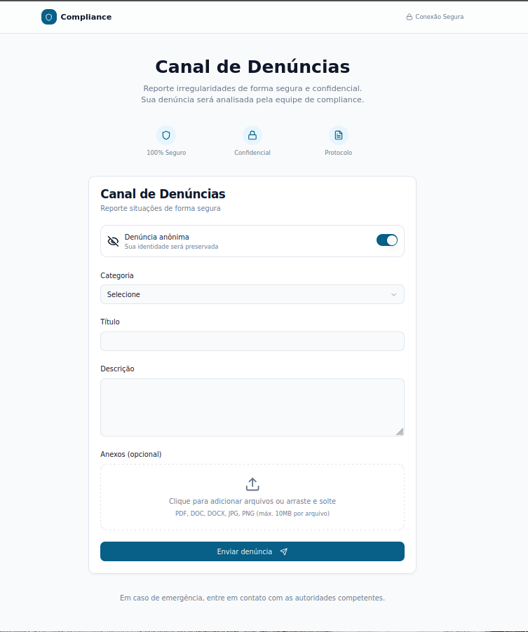
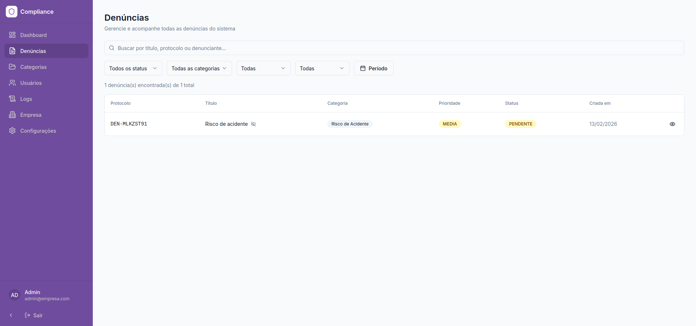
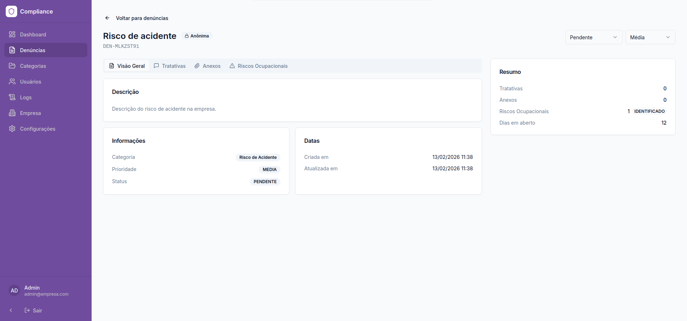
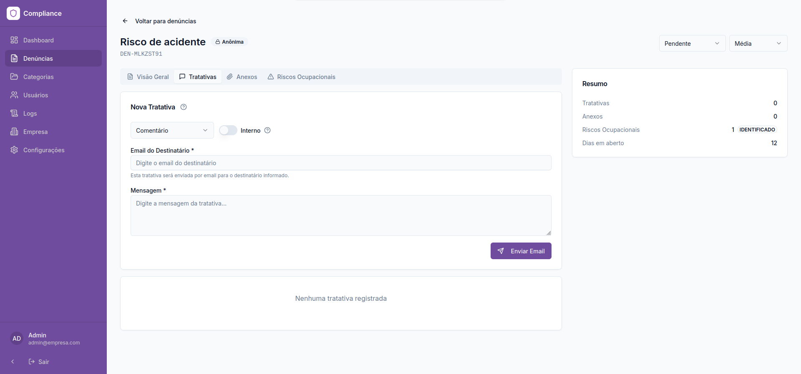
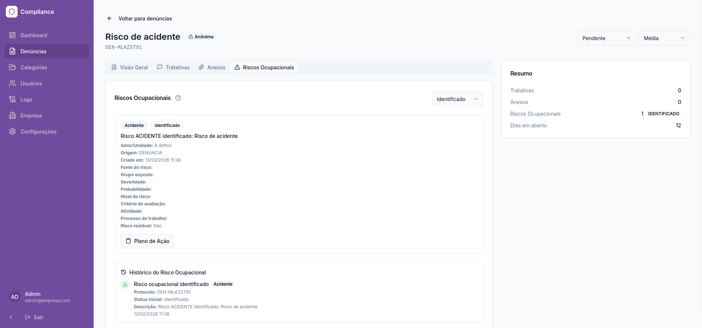
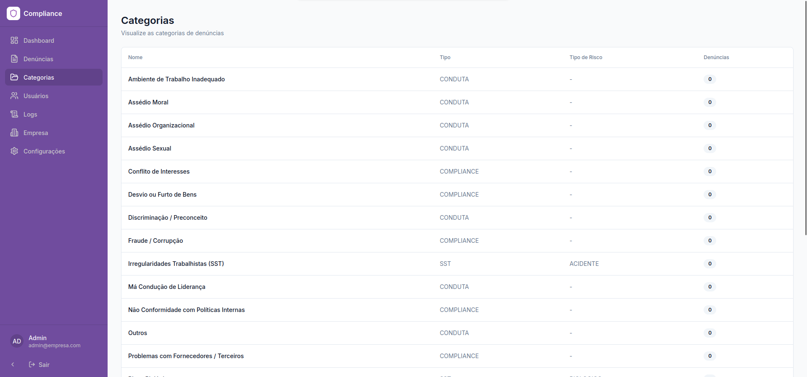
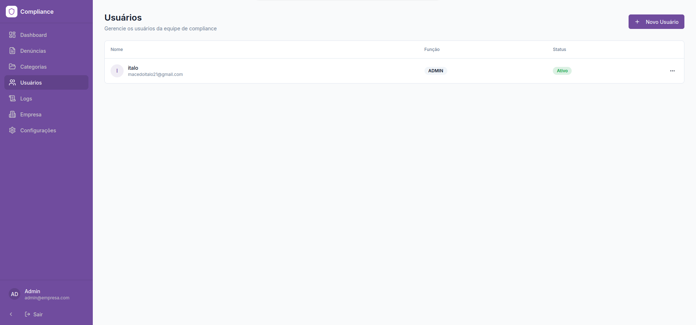
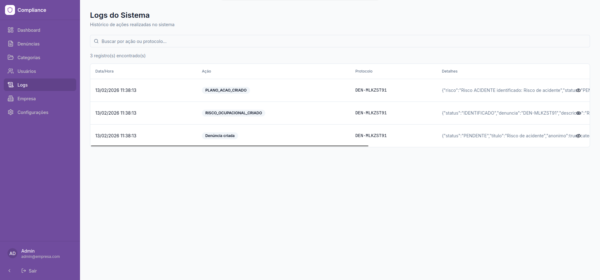

# Sistema-de-Denuncias-e-Compliance
Sistema web corporativo desenvolvido para gerenciamento de processos internos de compliance, com controle de acesso, rastreabilidade de ações e padronização de fluxos organizacionais.

🔒 Por questões de confidencialidade e segurança da empresa, o código-fonte não está disponível publicamente. Este repositório tem caráter demonstrativo da arquitetura, responsabilidades técnicas e resultados entregues.

## Contexto do Projeto

Projeto desenvolvido durante meu período de estágio, no qual atuei diretamente na:

Levantamento e entendimento de requisitos com a área interna

Definição da arquitetura da aplicação

Modelagem das regras de acesso

Implementação completa da solução

Organização da estrutura visando escalabilidade futura

A aplicação encontra-se em operação privada.

## Problema Resolvido

Antes da solução, os processos internos de compliance eram descentralizados e com baixo controle de rastreabilidade.

O sistema foi criado para:

Centralizar processos críticos

Controlar permissões por perfil

Garantir auditoria de ações

Organizar fluxos internos

Reduzir riscos operacionais

## Controle de Acesso (RBAC)

Implementação de autorização baseada em papéis:

Administrador

- Gestão completa do sistema

- Gestão de denuncias, tratativas, riscos ocupacionais e planos de ação

- Controle de acesso da equipe de compliance

Colaborador

- Registro de denuncias

- Acompanhamento de denuncias

## Segurança Aplicada

Autenticação com controle seguro de sessão

Middleware de proteção de rotas

Validações server-side

Estrutura organizada por camadas

Separação de responsabilidades

Proteção contra acesso indevido entre perfis

(Detalhes técnicos específicos foram omitidos por segurança.)

## Arquitetura e Boas Práticas

Estrutura modular e escalável

Separação clara entre frontend e backend

Organização de código voltada para manutenção

Padronização de componentes

Preparação para expansão futura do sistema

## Demonstração

Algumas interfaces do sistema estão disponíveis neste repositório para fins demonstrativos.

